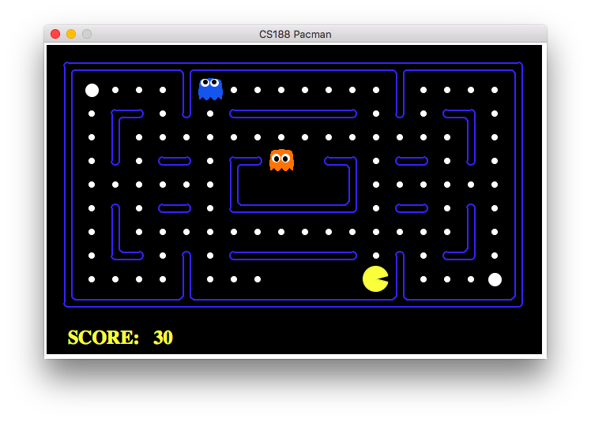
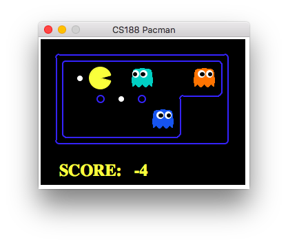
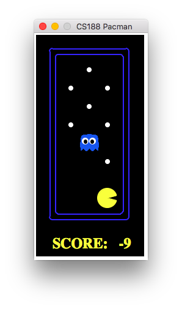

# AI Pacman
Given a pacman game map, use different strategies to clear the map.
## Introduction
### Acknowledgements
This project is based on Berkeley’s CS188 EdX course project. It is a modified and augmented version of ”Project 2: Multi-Agent Pacman” available at http://ai.berkeley.edu/multiagent.html.
### The Pacman Game
Pacman is a video game first developed in the 1980s. A basic description of the game can be found at https://en.wikipedia.org/wiki/Pac-Man.

## Getting Started
Download the repository and extract, then `cd` into the `pacman` folder.
Play a game of Pacman yourself by typing the following command:
```
python pacman.py
```
To run Pacman with a game agent use the -p command. Run Pacman as a GreedyAgent: 
```
python pacman.py -p GreedyAgent
```
All available agents are `MinimaxAgent`, `AlphaBetaAgent`, `ExpectimaxAgent`, `MonteCarloAgent`.
You can run Pacman on different maps using the -l command:
```
python pacman.py -p GreedyAgent -l testClassic
```
There are 9 playable maps, listed.
- minimaxClassic
- trappedClassic
- testClassic
- smallClassic
- capsuleClassic
- openClassic
- contestClassic
- mediumClassic
- originalClassic

For other options, please read the help message by running
```
python pacman.py -h
```
## Preview
### Original Classic Map

### Minimax Classic Map

### Test Classic Map

## License
[MIT](LICENSE)
